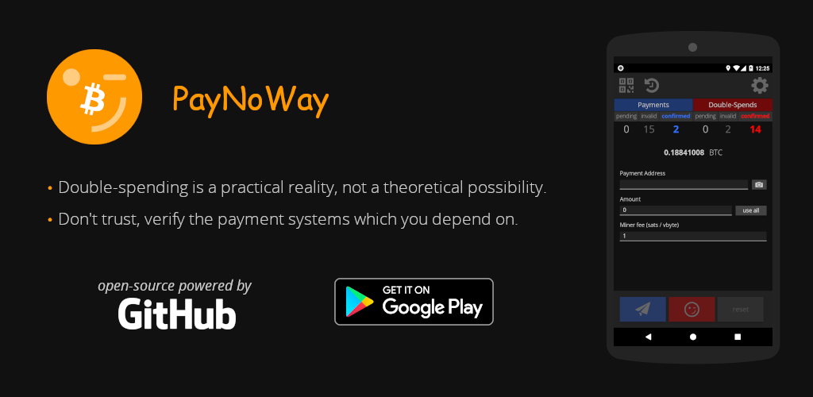

# PayNoWay

A mobile app for testing payment systems against double-spend attacks.



Double-spending is no longer a theoretical possibility but a practical reality. Most of the end-user applications used widely today leave their users vulnerable to being defrauded via double-spend attacks. PayNoWay is a tool that you can use to test the applications that you, or your business, depend on to accept on-chain cryptocurrency payments. If you would like to learn more about how double-spending works: [Double-Spending Made Easy](https://degreesofzero.com/talks/double-spending-made-easy/).

The PayNoWay app is available from the following sources:
* [F-Droid](https://f-droid.org/en/packages/com.github.samotari.paynoway)
* [Google Play](https://play.google.com/store/apps/details?id=com.github.samotari.paynoway)
* [Latest Release APK](https://github.com/samotari/paynoway/releases/tag/v2.1.0)

Find more information about this project here:
* [Disclaimers](#disclaimers)
* [How to test a payment system](#how-to-test-a-payment-system)
* [How does a double-spend work?](#how-does-a-double-spend-work)

The remaining topics consist of technical documentation. This information is useful if you would like to build the app from source or to fork and extend it:
* [Requirements](#requirements)
* [Getting Started](#getting-started)
  * [Android](#android)
    * [Running on Android (VM)](#running-on-android-vm)
    * [Running on Android (Device)](#running-on-android-device)
    * [Re-Generate Drawable Icons and Splash Images](#re-generate-drawable-icons-and-splash-images)
    * [Prepare F-Droid Release](#prepare-f-droid-release)
* [Tests](#tests)
* [Translations](#translations) - Pull-requests that translate the app into other languages are welcome!
* [Changelog](#changelog)
* [License](#license)


## Disclaimers

* This app is intended to be used for testing and educational purposes.
* Please do not use this app to double-spend against merchants without their explicit consent.
* A successful double-spend is not guaranteed - use at your own risk.
* You are responsible for creating a backup of your private key(s). Without a backup, if you delete the app or lose your device, your funds will be permanently lost.


## How to test a payment system

Follow these steps to test a payment system against a double-spend:
* Open the send view in the app
* Scan a QR code that contains either a payment request (e.g "bitcoin:ADDRESS?amount=0.00000123") or just an address
* If just an address was scanned above, then enter a non-zero amount to send
* Choose your fee rate (number of sats per vbyte)
* Press the blue "Pay" button to send a payment transaction
* Wait for the target merchant PoS to receive the unconfirmed transaction
* Press the red "Return" button to send the double-spend transaction
* Wait for one of the above transactions to confirm

Please consider adding the results of your double-spending tests to the [Double-spending results](https://github.com/chill117/double-spending) repository.


## How does a double-spend work?

This app uses the Replace-by-fee (RBF) feature of Bitcoin to replace (ie. double-spend) unconfirmed transactions. First, a payment transaction is sent with the target merchant's payment system as the recipient. Then a second, double-spend transaction is created and sent. This second transaction invalidates the first transaction by consuming at least one of the first transaction's inputs. The recipient of the double-spend transaction is your internal wallet address in the PayNoWay app. For more information about double-spending, please see [Double-Spending Made Easy](https://degreesofzero.com/talks/double-spending-made-easy/) - the slides used during a presentation about this topic.


## Requirements

This section lists the software requirements needed to build the app from source.

* [nodejs](https://nodejs.org/) - For Linux and Mac install node via [nvm](https://github.com/creationix/nvm).
* [make](https://www.gnu.org/software/make/)
* For Android development:
  * [Java Development Kit (JDK)](https://docs.oracle.com/javase/8/docs/technotes/guides/install/install_overview.html) version 8 or higher. Use your system's native package manager to install the JDK (if available).
  * [Android SDK](https://developer.android.com/studio/index.html) - On Ubuntu 18.04 or later, it is possible to install Android Studio from Ubuntu Software Sources.
  * [gradle](https://gradle.org/install/)
  * [adb](https://developer.android.com/studio/command-line/adb) - Not required, but is recommended.


## Getting Started

Before continuing, be sure you already have the project's [requirements](#requirements).

Download the project files via git:
```bash
git clone https://github.com/samotari/paynoway.git
```

Install the project's dependencies:
```bash
cd paynoway
npm ci
```

Build the application files:
```bash
npm run build
```

### Android

Before installing and running the app on Android, you must prepare the Android platform with cordova:
```bash
npm run prepare:android
```
This downloads the cordova plugins which are necessary to build the app for Android devices.

#### Running on Android (VM)

Run the following command to check to see if there are any available Android virtual devices:
```bash
adb devices
```

Install and run the app on the virtual device with the following command:
```bash
npm run android-vm
```

#### Running on Android (Device)

To install and run the app on an Android device, you must first:
* [Enable developer mode](https://developer.android.com/studio/debug/dev-options) on the device.
* Enable USB debugging

Once developer mode and USB debugging are enabled, connect the device to your computer via USB. Run the following command to check to see if your computer is authorized:
```bash
adb devices
```

Install and run the app on the device: with the following command
```bash
npm run android
```

#### Create Signed APK

Create your signing key:
```bash
npm run android-generate-signing-key
```

Build a production APK:
```bash
npm run build:prod && npm run build:apk
```
If successful, it should have created a new `.apk` file at the following path:
```
./platforms/android/app/build/outputs/apk/release/app-release.apk
```

To install the newly created APK onto an Android device:
```bash
adb install ./platforms/android/app/build/outputs/apk/release/app-release.apk
```
* You may need to run `adb devices` before the above command.
* And if the app is already installed on the device, you will need to use the `-r` flag to reinstall it.


#### Re-Generate Drawable Icons and Splash Images

The following script uses the SVG images found in `./assets/android` to generate all sizes for icons and splash images for the Android platform:
```bash
./scripts/build-android-drawable-icons-and-splash.sh
```
Output files are written to `./src/images/android`.


### Prepare F-Droid Release

F-Droid requires the Android platform files (built by Cordova) in order to build an APK. This repository contains a special branch specifically for F-Droid - the branch contains the platform files from the latest, stable release.

After making a release of the app, the F-Droid branch must be updated as well. Run the following script to do this:
```bash
npm run release:fdroid
```
Note that write access for this repostiory is required.


## Tests

This project includes automated tests. To run them:
```bash
npm test
```


## Translations

Your help in translating the app into other languages is welcome. To do so please see the following steps:

* Find the app's primary language file [here](https://github.com/samotari/paynoway/blob/master/src/js/lang/en.js).
* Copy the contents of the file to the text editing program of your choice.
* Change the values only - leave the keys un-translated. The reference keys are used internally in the app. Please see the following example:

```js
var app = app || {};

app.lang = app.lang || {};

// The lang key here is the ISO_639-1 language code. See:
// https://en.wikipedia.org/wiki/List_of_ISO_639-1_codes
app.lang['es'] = (function() {

	return {
		'self.label': 'Español'
		'busy-text': 'Espere por favor...',
		'close': 'Cerrar',
		'copy': 'Copiar',
	};

})();
```

* Once you've finished the translations, create an issue in this project [here](https://github.com/samotari/paynoway/issues) and copy/paste the contents of your translation file into the new issue.
	* Alternatively, you can fork this project and create a pull-request with the new file.

* Thanks for taking the time to make a translation!


## Changelog

See [CHANGELOG.md](https://github.com/samotari/paynoway/blob/master/CHANGELOG.md)


## License

This project is licensed under the [GNU General Public License v3 (GPL-3)](https://tldrlegal.com/license/gnu-general-public-license-v3-(gpl-3)):
> You may copy, distribute and modify the software as long as you track changes/dates in source files. Any modifications to or software including (via compiler) GPL-licensed code must also be made available under the GPL along with build & install instructions.
